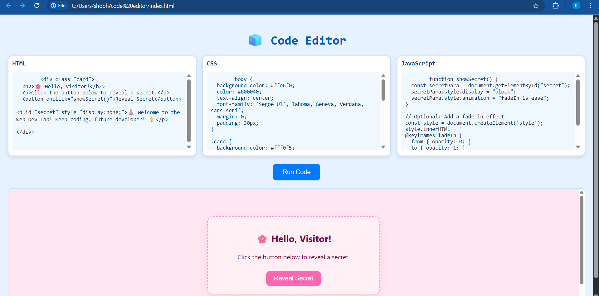

# 💻 Web Development Lab Code Editor

This is a lightweight and interactive **web-based code editor** made for students and learners in a **Web Development Lab**. It allows you to type and test HTML, CSS, and JavaScript code with live preview – all in a single page!

## 🌟 Features

- ✍️ Separate code boxes for HTML, CSS, and JavaScript
- 🧪 "Run Code" button that combines and displays live output
- 🎨 Soft blue and pink contrast theme with a clean layout
- 💬 Pre-filled sample code with an interactive hidden message
- ⚡ 100% client-side (no internet/server needed after loading)

## 📸 Screenshot

> The screenshot gives a quick look at how the editor appears in the browser.

## 🚀 Try It Out (if GitHub Pages is enabled)

[🔗 Live Demo](https://khushi494.github.io/web-code-editor)  

## 🛠️ Technologies Used

- **HTML5** – page structure  
- **CSS3** – styling and layout  
- **JavaScript** – interactive execution and output  

## 🎯 Objective

To create a web-based learning tool for Web Dev Lab students to:
- Learn HTML, CSS, and JS together
- Instantly preview code
- Improve coding confidence with a friendly UI

---

🧑‍💻 Developed for **Web Development Lab Project**  
🎓 By: *KHUSHI SINGH*  
